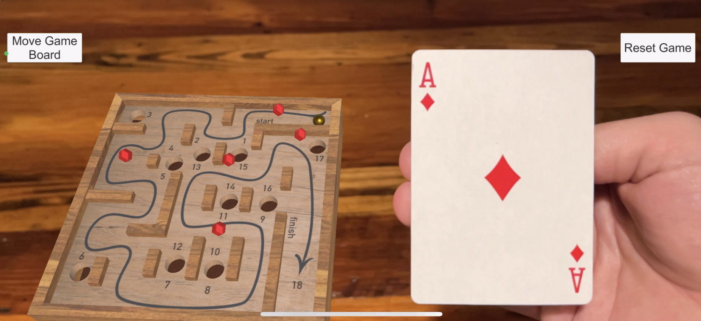

# HW3: labyARinth

An AR game based on the tabletop labyrinth game. The player moves a marble along a path while avoiding holes. If the marble falls into a hole, the player's score will be that of the hole. The value of each hole increases as the marble travels further, with the highest score associated with completing the maze.

The game board 3D model was made in Fusion 360 and the floor plan texture design was made in Adobe Illustrator.

[New] labyARinth is now playable on mobile and also includes image tracking. When a specific playing card is introduced to the scene, collectables are unlocked and allow the player to gain bonus points during game play.

[YouTube video](https://youtu.be/ISBj4lPbRQo)

